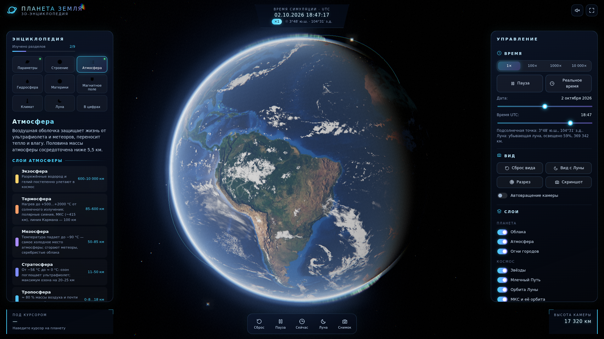
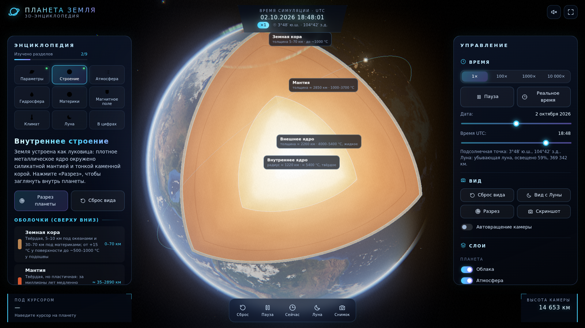
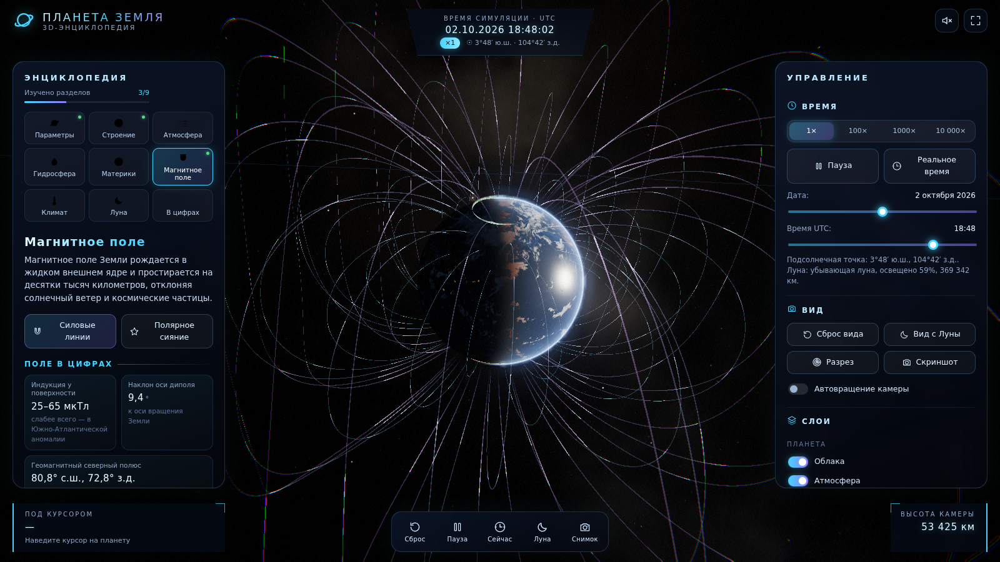
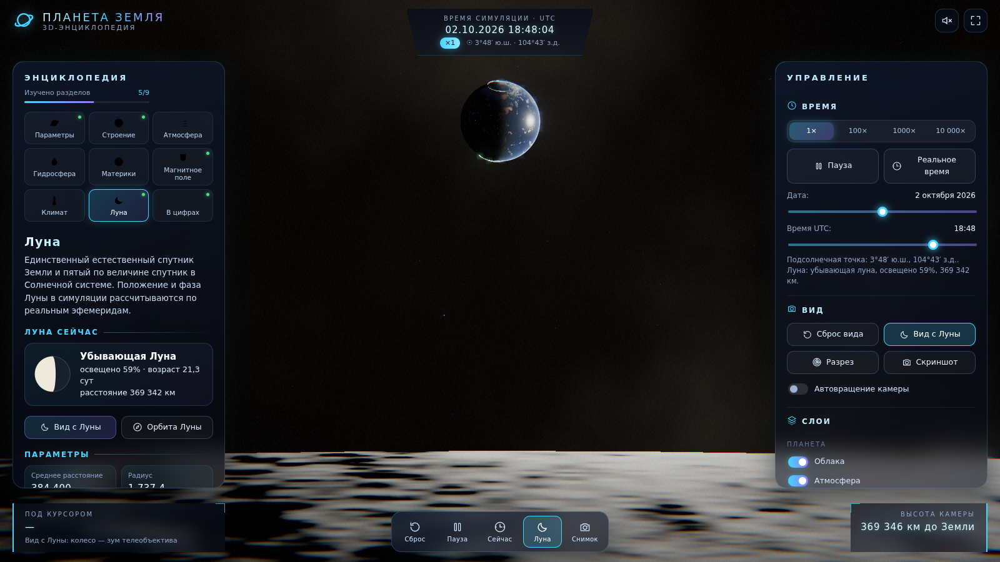
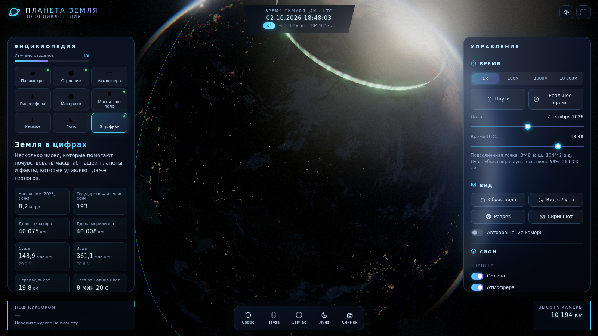
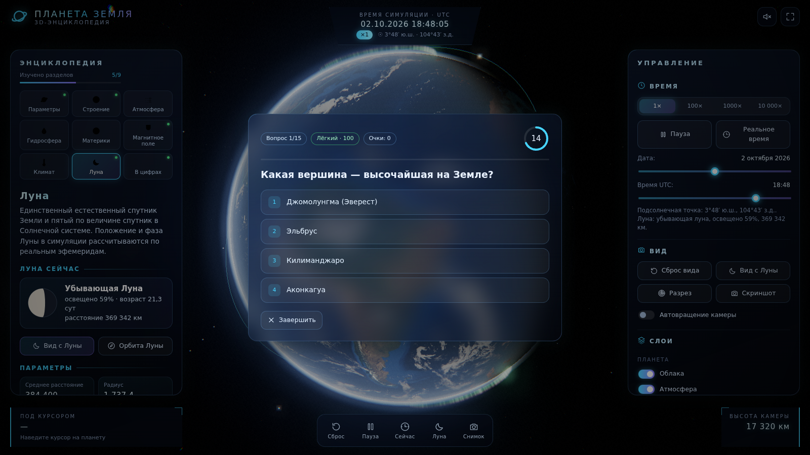
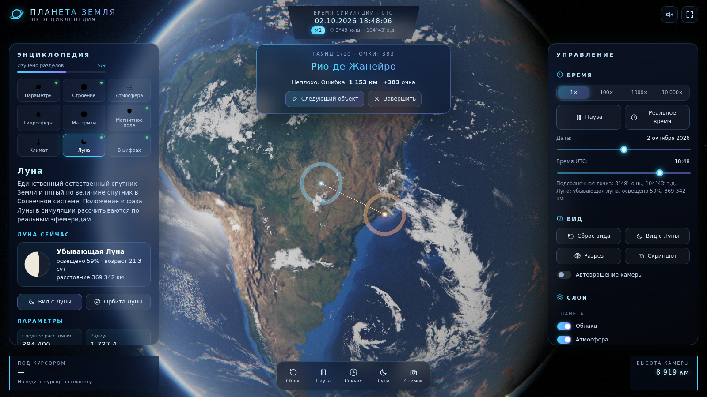
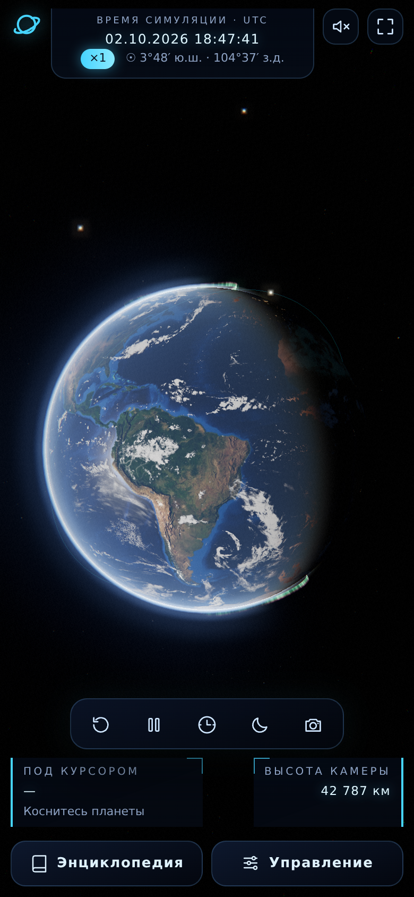

# 🌍 Планета Земля — интерактивная 3D-энциклопедия

Фотореалистичная интерактивная 3D-игра-энциклопедия о Земле в браузере: реальное положение Солнца и Луны
в текущий момент, собственные GLSL-шейдеры поверхности, облаков и атмосферы (рассеяние Рэлея и Ми),
разрез планеты, магнитосфера с полярными сияниями, девять разделов с научными данными, викторина
и игра «Найди на глобусе». Чистые ES-модули без сборщиков — работает как статический сайт.



| Разрез планеты | Магнитосфера | Вид с Луны |
|---|---|---|
|  |  |  |
| **Ночная сторона и сияния** | **Викторина** | **«Найди на глобусе»** |
|  |  |  |

<p align="center"></p>

> Скриншоты сняты автоматически в headless Chromium с программным рендером WebGL (SwiftShader).
> В песочнице CDN был недоступен, поэтому для скриншотов использовались снимки NASA Blue Marble /
> Black Marble из npm-пакета `three-globe` (только в тестовом запуске, в репозиторий они не входят).
> Как выглядят процедурные запасные текстуры — см. `docs/screenshots/desktop-fallback.png`.

## Возможности

**Фотореалистичная Земля**
- Текстуры NASA Blue Marble (день, ночные огни, рельеф, маска океанов, облака) с CDN, анизотропная фильтрация и mipmaps.
- Процедурные запасные текстуры (canvas) на случай недоступности CDN: материки, пустыни, леса, огни ~150 агломераций, облака, рельеф, Луна. Если настоящая текстура придёт после таймаута — она заменит запасную на лету.
- Шейдер поверхности: мягкий терминатор с оранжево-красной сумеречной полосой, тёплые огни городов только на ночной стороне с угасанием к терминатору, солнечный блик GGX на океанах по маске (суша блика не даёт), normal map, тени облаков, голубая кайма по Френелю, атмосферная дымка над диском.
- Облака на отдельной сфере со своим дрейфом, закатный оттенок, подсветка снизу огнями городов ночью.
- Атмосфера — оболочка `BackSide` с аддитивным смешиванием и расчётом рассеяния Рэлея и Ми по модели Шона О'Нила (GPU Gems 2): голубой ореол днём, оранжевый на линии заката, почти невидимый ночью, толще у горизонта.
- Физика: наклон оси 23,44°, вращение по гринвичскому звёздному времени, ускорение 1×/100×/1000×/10 000×, подсолнечная точка по дате и времени, перемотка даты и времени ползунками.

**Космос**
- 14 000 процедурных звёзд с цветом по температуре и реалистичным распределением блеска + 45 реальных ярких звёзд (J2000), процедурный Млечный Путь в галактических координатах.
- Солнце с короной, лучами, bloom и бликами объектива (с учётом заслонения Землёй и Луной).
- Луна по реальным эфемеридам: фазы, наклон орбиты 5,14°, приливный захват, пепельный свет, рельеф; линия орбиты за сидерический месяц.
- МКС — светящаяся точка на круговой орбите ~415 км с наклонением 51,64° и периодом ~92,9 мин.
- Постобработка: UnrealBloom, ACES Filmic, лёгкая виньетка, зерно, хроматическая аберрация по краям.

**Камера и управление**
- OrbitControls с демпфированием, мышь/касание, колесо/щипок, ограничения дистанции; автовращение с паузой при взаимодействии.
- Кинематографичные перелёты к материкам, океанам, Марианской впадине, Луне; режим «Вид с Луны» в духе снимка «Восход Земли».
- Клик по глобусу: координаты, регион (материк, остров, море или океан), ближайший крупный город, высота Солнца, местное солнечное время.
- Кнопки: «Сброс вида», «Пауза», «Реальное время», «Вид с Луны», «Скриншот» (PNG), «Разрез».

**Энциклопедия (9 разделов, все данные — в `js/data.js`)**
1. Основные параметры · 2. Внутреннее строение (разрез с подписями слоёв) · 3. Атмосфера (слои, анимированная диаграмма состава, озон) · 4. Гидросфера (океаны, Марианская впадина, пресная вода) · 5. Материки (подсветка контуром, перелёт и карточка) · 6. Магнитное поле (силовые линии, полярные сияния) · 7. Климат и биосфера (климатические пояса на глобусе) · 8. Луна (текущая фаза) · 9. Земля в цифрах.
- Оверлеи: сетка широт и долгот, экватор/тропики/полярные круги, часовые пояса, границы материков, климатические зоны.

**Игры**
- «Викторина»: 15 вопросов (5 лёгких, 5 средних, 5 сложных) из пула 30, таймер 20 с, очки за скорость, комбо до ×2, ранги «Новичок», «Исследователь», «Астронавт».
- «Найди на глобусе»: 10 раундов, ошибка по формуле гаверсинусов в км, дуга большого круга между щелчком и ответом.
- 15 достижений с анимированными уведомлениями, прогресс изучения разделов, рекорды (localStorage).

**Звук** — эмбиент космоса и тихие звуки интерфейса на Web Audio API без внешних файлов; по умолчанию выключен.

**Производительность** — автоматический режим качества High/Medium/Low по FPS и ручной переключатель; `devicePixelRatio ≤ 2`; адаптивный интерфейс (на телефоне панели выдвигаются снизу).

## Быстрый старт

ES-модули не работают при открытии файла напрямую (`file://`), нужен любой статический сервер:

```bash
git clone https://github.com/prohasiki/asteroid.git
cd asteroid
python3 -m http.server 8000      # или: npx serve .
```

Откройте <http://localhost:8000>. Нужен браузер с WebGL 2 (Chrome, Edge, Firefox, Safari 15+) и доступ
к `cdn.jsdelivr.net` (Three.js и текстуры) и Google Fonts. Без доступа к CDN текстур сцена
продолжит работать на процедурных текстурах.

## Управление

| Действие | Мышь / касание | Клавиши |
|---|---|---|
| Вращать камеру | перетаскивание | — |
| Приблизить / отдалить | колесо / щипок | — |
| Информация о точке | щелчок / тап по глобусу или Луне | — |
| Пауза / продолжить | кнопка «Пауза» | `Пробел` |
| Скорость времени | 1× · 100× · 1000× · 10 000× | `1`–`4` |
| Сброс вида | «Сброс вида» | `R` |
| Вид с Луны (колесо — зум) | «Вид с Луны» | `M` |
| Скриншот PNG | «Скриншот» | `P` |
| Ответ в викторине | кнопки | `1`–`4`, `Enter` — далее, `Esc` — выход |

## Структура проекта

```
index.html                 разметка, import map (Three.js r160 с jsDelivr), подключение модулей
css/style.css              стили интерфейса (glassmorphism, HUD, адаптивность)
js/main.js                 инициализация сцены, цикл рендера, взаимодействие, действия
js/earth.js                Земля: поверхность, облака, атмосфера, слои и оверлеи
js/sky.js                  звёзды, Млечный Путь, Солнце, Луна, МКС
js/post.js                 постобработка (bloom, OutputPass, кинематографичный проход)
js/camera.js               перелёты камеры, автовращение, «Вид с Луны»
js/ui.js                   панели, вкладки, HUD, карточки, уведомления, иконки
js/data.js                 все научные данные и тексты, контуры материков, города
js/quiz.js, js/findgame.js игровые режимы
js/achievements.js         достижения и прогресс
js/audio.js                звук на Web Audio API
js/interior.js             разрез планеты
js/magnetosphere.js        силовые линии и полярные сияния
js/continents.js           контуры и подсветка материков
js/markers.js              метки и дуги на поверхности
js/quality.js              автонастройка качества по FPS
js/astro.js                астрономия: GMST, Солнце, Луна, МКС
js/geo.js                  регион по координатам, гаверсинусы, дуги большого круга
js/textures.js             загрузка текстур (LoadingManager) и процедурные запасные
js/shaders/*.glsl.js       GLSL-шейдеры как экспортируемые строки
tests/serve.mjs            тестовый статический сервер (подмена import map на локальный three)
tests/e2e.mjs              сквозные проверки в headless Chromium + скриншоты
.github/workflows/pages.yml  автодеплой на GitHub Pages
```

## Как это устроено

- **Системы координат.** Сцена — эклиптическая (ось Y — полюс эклиптики). Группа Земли наклонена на 23,44°, сетка Земли поворачивается на гринвичское среднее звёздное время, поэтому освещённость совпадает с реальной. Направление на Солнце и положение Луны — по упрощённым рядам из «Astronomical Almanac» и Ж. Миуса (точность ~0,01° для Солнца, ~0,3° для Луны). Расстояние до Луны — реальное (≈ 60 радиусов Земли).
- **Атмосфера** — модель О'Нила (2,5 % толщины, масштаб высоты 25 %), посчитанная во фрагментном шейдере: оболочка неба (SkyFromSpace) и дымка над поверхностью (GroundFromSpace).
- **Разрез** — три плоскости отсечения с `clipIntersection` в системе вращающейся Земли и «крышки» срезов, раскрашенные шейдером по радиусу.
- **Регион под курсором** — аналитическое пересечение луча со сферой, затем «точка в многоугольнике» по упрощённым контурам материков, внутренних морей и озёр.

## Проверка

```bash
node tests/e2e.mjs            # проверки + скриншоты с процедурными текстурами
node tests/e2e.mjs --nasa     # скриншоты со снимками NASA из npm-пакета three-globe
```

Скрипт сам ставит `three@0.160.0` и `playwright` во временную папку `.test-deps/` (в `.gitignore`),
поднимает статический сервер, подменяющий адрес Three.js в import map на локальный только на время
теста, запускает headless Chromium с программным WebGL (`--use-angle=swiftshader`), блокирует CDN
текстур и шрифтов и проверяет: загрузку без ошибок в консоли, создание WebGL-контекста, срабатывание
запасных текстур, совпадение подсолнечной точки с расчётом, переключение вкладок, корректность
координат клика, управление временем, слои, разрез, «Вид с Луны», скриншот, прохождение викторины
от начала до конца, игру «Найди на глобусе», достижения, звук, resize и мобильную версию 390×844.
Отчёт — в `tests/output/report.md`.

## Публикация на GitHub Pages

Workflow `.github/workflows/pages.yml` проверяет синтаксис модулей и публикует сайт при каждом пуше
в ветку `main`. После первого мержа один раз включите Pages:
**Settings → Pages → Build and deployment → Source: GitHub Actions**.
Адрес сайта: **<https://prohasiki.github.io/asteroid/>**.

## Источники данных

- NASA Earth Fact Sheet и Moon Fact Sheet (NSSDCA) — размеры, масса, орбиты.
- NOAA NGDC, Eakins & Sharman (2010) — площади, объёмы и глубины океанов; Five Deeps Expedition (2019) и измерения 2020–2021 гг. — максимальные глубины.
- USGS Water Science School — распределение воды на Земле.
- WMO — рекорды температуры, оценка потепления 2024 г.; WMO/UNEP (2022) — восстановление озонового слоя; NOAA (Мауна-Лоа) — CO₂.
- NOAA/NCEI World Magnetic Model WMM2025 — геомагнитный и магнитный полюсы.
- UN World Population Prospects 2024 — население.
- Bar-On, Phillips, Milo (PNAS, 2018) — биомасса; Mora et al. (PLoS Biology, 2011) — число видов.
- Astronomical Almanac, J. Meeus «Astronomical Algorithms» — формулы положения Солнца и Луны; каталог ярких звёзд — Yale Bright Star Catalogue (J2000).

## Текстуры, шрифты и библиотеки

- Текстуры Земли и Луны загружаются в браузере пользователя из примеров three.js через jsDelivr (`https://cdn.jsdelivr.net/gh/mrdoob/three.js@r160/examples/textures/planets/`); исходные изображения — NASA Visible Earth / Blue Marble (общественное достояние).
- [Three.js](https://threejs.org) r160 (MIT) — с jsDelivr через import map.
- Шрифты Orbitron, Exo 2 и Inter — Google Fonts (SIL Open Font License).
- Иконки — собственные line-art SVG.

## Известные ограничения

- Контуры материков упрощены (точность ~0,5–2°), климатические пояса показаны упрощённо по широте.
- Положение МКС модельное (круговая орбита без TLE), поэтому точка не совпадает с реальной МКС.
- Либрация Луны и атмосферная рефракция не моделируются.
- Без доступа к jsDelivr не загрузится Three.js — страница покажет сообщение об ошибке.

## Лицензия

MIT — см. [LICENSE](LICENSE).
